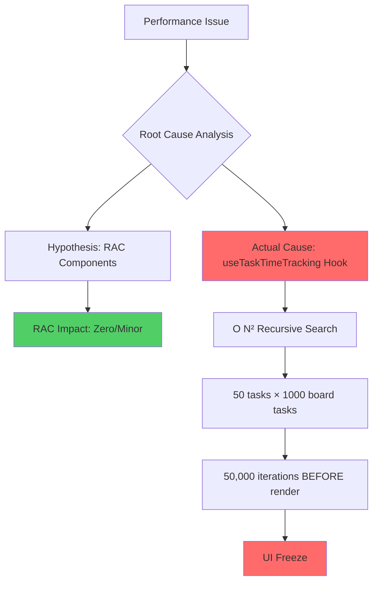
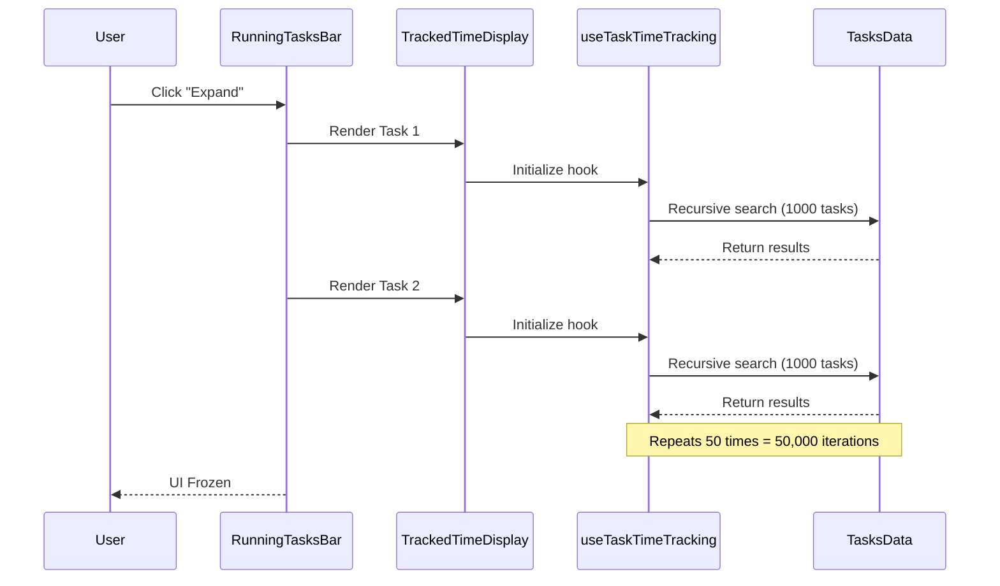
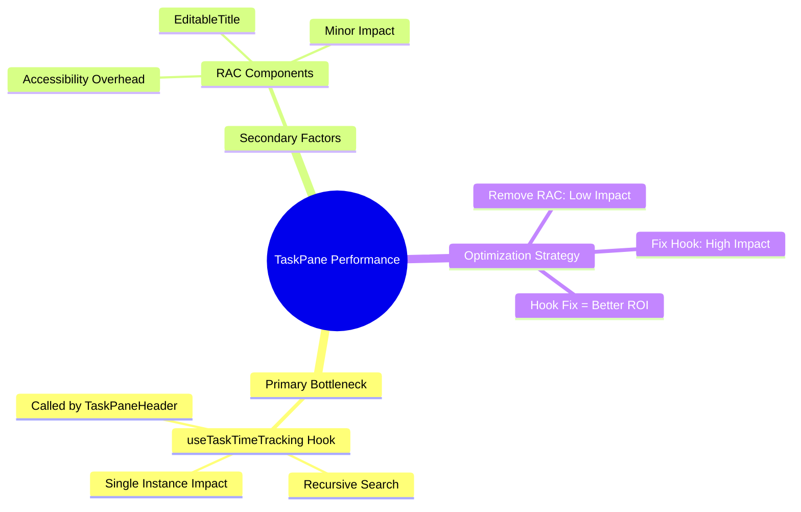
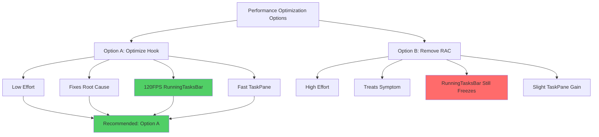
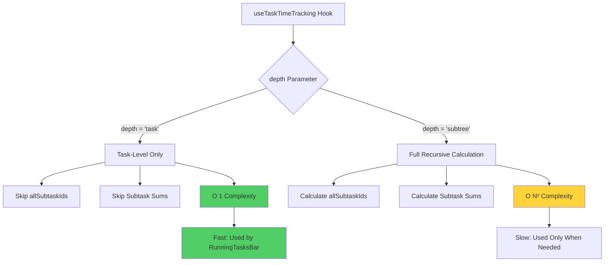
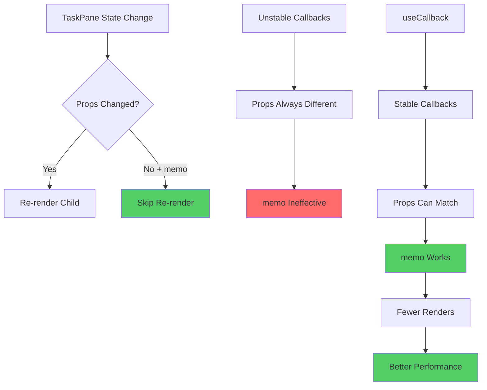
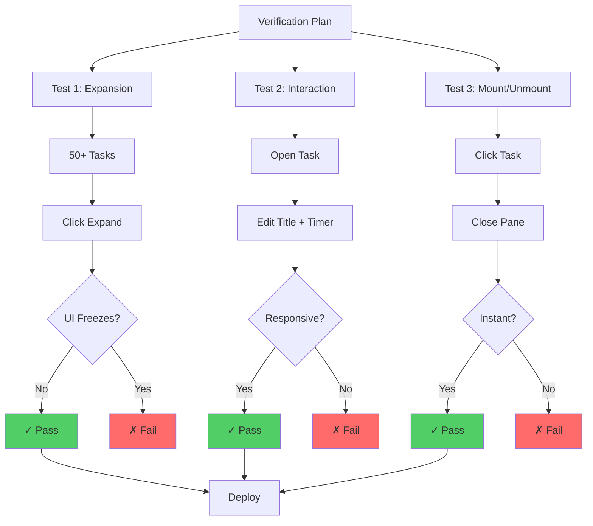

# Deep Dive Study Guide: React Performance Optimization Case Study

## Section 1: Executive Summary & Core Diagnosis

### Title: The Real Performance Bottleneck

**Core Concept: The performance issue is NOT caused by React Aria Components (RAC). The real culprit is the `useTaskTimeTracking` hook performing O(N²) recursive searches, which executes before any UI component renders.**

#### Details:

- **Recommendation**: Do not remove RAC from the codebase
- **Primary bottleneck**: `useTaskTimeTracking` hook performs expensive recursive operations
- **Scale of the problem**: 50 displayed tasks × 1000 board tasks = 50,000 synchronous iterations
- **RAC's actual impact**: Zero on RunningTasksBar, minor on TaskPane
- **Key insight**: The computational cost occurs in the data layer, not the presentation layer

#### Historical Context:

Two possible explanations for previous 120FPS performance:

1. **Usage Change**: RunningTasksBar didn't display dynamic timers for every task before refactor
2. **Dataset Change**: Number of recursive subtasks grew, hitting O(N²) algorithm tipping point

### Visual Logic:

---

## Section 2: RunningTasksBar Performance Analysis

### Title: Critical Performance Issue in Task List Display

**Core Concept: Clicking "Expand" in RunningTasksBar freezes the UI because each displayed task triggers a full recursive search through all board tasks, creating an O(N²) computational complexity.**

#### Details:

**Symptom**:

- UI freezes when clicking "Expand" button
- Affects lists with 50+ tasks

**Root Cause Chain**:

1. RunningTasksBar renders a list of tasks
2. Each task renders TrackedTimeDisplay component
3. TrackedTimeDisplay calls useTaskTimeTracking hook
4. Hook performs recursive search over ALL board tasks for EVERY instance

**Mathematical Impact**:

- Formula: `displayed_tasks × total_board_tasks = total_iterations`
- Example: 50 tasks × 1000 tasks = 50,000 iterations
- All iterations happen synchronously on main thread

**RAC Involvement**:

- RunningTasksBar does NOT use React Aria Components
- Removing RAC will have zero effect on this issue

**Key Takeaway**:

- The problem occurs before any React rendering happens
- This is a data processing bottleneck, not a UI rendering bottleneck

### Visual Logic:

---

## Section 3: TaskPane Performance Analysis

### Title: Secondary Performance Impact on Task Detail View

**Core Concept: TaskPane experiences slow mount times primarily due to the same useTaskTimeTracking bottleneck, with minor additional overhead from RAC components that is negligible compared to the data processing lag.**

#### Details:

**Symptom**:

- Slow mount time when opening task details
- Noticeable delay before content appears

**Root Cause**:

- TaskPaneHeader calls useTaskTimeTracking hook
- Same recursive search problem as RunningTasksBar
- Single instance (vs. 50 in RunningTasksBar) = less severe but still noticeable

**RAC Impact Assessment**:

- EditableTitle component uses React Aria Components
- Has slight overhead from accessibility features
- This overhead is **overshadowed** by data processing lag
- Removing RAC would provide minimal improvement

**Optimization Priority**:

- Optimizing useTaskTimeTracking hook = significant speed improvement
- Removing RAC = minor speed improvement
- Hook optimization provides better ROI (Return on Investment)

### Visual Logic:

---

## Section 4: Performance Benchmarking & Decision Matrix

### Title: Comparative Analysis of Optimization Approaches

**Core Concept: Optimizing the useTaskTimeTracking hook (Option A) delivers superior performance improvements across all metrics with lower implementation effort compared to removing RAC (Option B).**

#### Details:

**Option A: Optimize Hook (Recommended)**

- RunningTasksBar: Instant response (120FPS)
- TaskPane Mount: Fast
- TaskPane Editing: Responsive
- Implementation Effort: Low

**Option B: Remove RAC (Not Recommended)**

- RunningTasksBar: Still freezes (no improvement)
- TaskPane Mount: Slight gain only
- TaskPane Editing: Responsive
- Implementation Effort: High (refactoring all RAC components)

**Key Decision Factors**:

1. **Effectiveness**: Option A fixes root cause; Option B addresses symptom
2. **Effort**: Option A requires targeted changes; Option B requires widespread refactoring
3. **Risk**: Option A is surgical; Option B could introduce regressions
4. **Future-proofing**: Option A scales; Option B doesn't solve core problem

### Visual Logic:

---

## Section 5: Implementation Plan - Hook Optimization

### Title: Targeted Fix for useTaskTimeTracking Performance

**Core Concept: Add a `depth` parameter to useTaskTimeTracking that controls recursion level, allowing components to skip expensive subtask calculations when only task-level data is needed.**

#### Details:

**Hook Modification** (`useTaskTimeTracking.ts`):

- Add `depth` parameter to hook options (default: `'task'`)
- Conditional logic: Only calculate `allSubtaskIds` and subtask sums if `depth !== 'task'`
- Prevents O(N²) behavior in list contexts

**Why This Works**:

- RunningTasksBar only needs task-level time data, not subtask aggregates
- Skipping recursion eliminates 50,000 unnecessary iterations
- Components that need subtask data can still request it explicitly

**Implementation Complexity**:

- Low: Single parameter addition
- Backward compatible: Default behavior preserved
- Localized changes: Only hook and its consumers affected

**User Review Required**:

- Verify all consumers of useTaskTimeTracking (TaskPane, RunningTasksBar)
- Ensure no other components depend on automatic subtask calculation

### Visual Logic:

---

## Section 6: Implementation Plan - Component Memoization

### Title: Preventing Unnecessary Re-renders Through React Optimization

**Core Concept: Wrap components with React.memo and stabilize callback props with useCallback to prevent cascade re-renders when parent state changes but child props remain unchanged.**

#### Details:

**Components to Memoize**:

1. **TaskPaneHeader**: Prevents re-render when TaskPane updates
2. **EditableTitle**: Prevents re-render during title editing
3. **TaskHeaderStateSwitcher**: Prevents re-render during state changes
4. **TrackedTimeDisplay**: Will receive `depth` prop

**Callback Stabilization** (TaskPane.tsx): Need to wrap with `useCallback`:

- `onSaveTitle`
- `onToggleEditMode`
- `onOpenReopenModal`
- `onStartTimer`
- `onStopTimer`
- `onOpenManualEntry`

**Why This Matters**:

- React.memo prevents child re-renders when props are shallow-equal
- Unstable callbacks (recreated each render) break memo optimization
- useCallback creates stable function references
- Combined: Eliminates wasted render cycles

**Additional Optimization**:

- Verify `breadcrumbs` prop stability (already uses useMemo)
- Check if `tasksMap` dependency can be optimized

### Visual Logic:

---

## Section 7: Verification & Testing Strategy

### Title: Manual Performance Validation Plan

**Core Concept: Since no automated performance tests exist, use systematic manual testing across three critical user flows to verify optimization success.**

#### Details:

**Test Scenario 1: RunningTasksBar Expansion**

- **Setup**: Open app with 50+ tasks
- **Action**: Click "Expand" on RunningTasksBar
- **Success Criteria**: UI does not freeze, smooth animation, instant response

**Test Scenario 2: TaskPane Interaction**

- **Setup**: Open a task from list
- **Actions**:
    - Click "Edit" title
    - Type characters
    - Observe timer ticking (every second)
- **Success Criteria**:
    - Typing is responsive (no input lag)
    - Timer updates smoothly
    - No lag during timer ticks

**Test Scenario 3: Mounting/Unmounting**

- **Actions**:
    - Click a task in RunningTasksBar
    - Close TaskPane
- **Success Criteria**:
    - TaskPane opens instantly (< 100ms perceived)
    - TaskPane closes smoothly
    - No visual artifacts or flickering

**Testing Environment**:

- Use realistic dataset size (1000+ tasks)
- Test on lower-end hardware for worst-case performance
- Monitor Chrome DevTools Performance tab during tests

**Success Metrics**:

- 120FPS maintained during animations
- < 16ms frame time (60 FPS minimum)
- No jank or stuttering during interactions

### Visual Logic:

---

# Flashcard Dataset

**Q: What is the primary cause of the performance regression in the TaskPane and RunningTasksBar?** A: The useTaskTimeTracking hook performing O(N²) recursive searches over all board tasks, not React Aria Components (RAC).

**Q: How many iterations occur when RunningTasksBar displays 50 tasks with 1000 total board tasks?** A: 50,000 synchronous iterations (50 displayed tasks × 1000 board tasks).

**Q: What is the impact of removing RAC on RunningTasksBar performance?** A: Zero impact. RunningTasksBar does not use RAC components, so removing them won't fix the freeze.

**Q: What are the two possible explanations for why the app was 120FPS before the refactor?** A: (1) RunningTasksBar didn't display dynamic timers for every task before, or (2) the number of recursive subtasks grew, hitting the O(N²) algorithm's tipping point.

**Q: What is the recommended optimization approach and why?** A: Option A: Optimize the useTaskTimeTracking hook. It fixes the root cause with low effort and delivers instant performance (120FPS) while removing RAC still leaves the freeze unresolved.

**Q: What parameter should be added to useTaskTimeTracking to fix the performance issue?** A: A `depth` parameter (default: 'task') that controls whether to calculate subtask recursion. Setting depth='task' skips expensive recursive calculations.

**Q: Why does the depth parameter solve the O(N²) problem?** A: RunningTasksBar only needs task-level data, not subtask aggregates. Skipping recursion eliminates 50,000 unnecessary iterations.

**Q: What three components should be wrapped with React.memo?** A: TaskPaneHeader, EditableTitle, and TaskHeaderStateSwitcher.

**Q: Why is useCallback needed when implementing React.memo?** A: React.memo prevents re-renders when props are unchanged, but unstable callbacks (recreated each render) make props always different, breaking the optimization.

**Q: What are the six callbacks in TaskPane.tsx that need useCallback wrapping?** A: onSaveTitle, onToggleEditMode, onOpenReopenModal, onStartTimer, onStopTimer, and onOpenManualEntry.

**Q: What is the first manual test for verifying the optimization?** A: Open the app with 50+ tasks, click "Expand" on RunningTasksBar, and verify the UI does not freeze.

**Q: What should happen during the TaskPane interaction test?** A: When editing a title and watching the timer tick every second, typing should be responsive with no lag during timer updates.

**Q: What is the success criteria for the mounting/unmounting test?** A: TaskPane should open instantly (< 100ms perceived) and close smoothly without visual artifacts or flickering.

**Q: Why is the computational bottleneck described as happening "before any UI component renders"?** A: The useTaskTimeTracking hook performs its recursive search during hook initialization, which occurs before React renders any components to the DOM.

**Q: What is the estimated effort level for Option A vs Option B, and what are the expected RunningTasksBar results?** A: Option A (Optimize Hook): Low effort, instant 120FPS. Option B (Remove RAC): High effort, still freezes with no improvement.