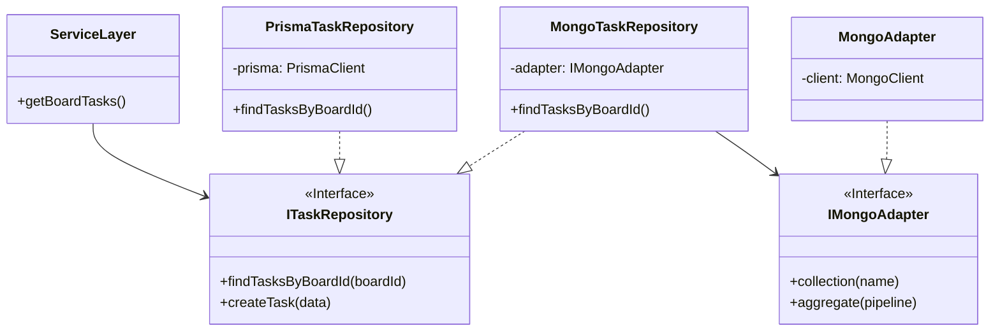

# Architecture Plan: Data Access Layer Refactoring (Specialized Ports & Adapters)

## 1. Analysis & Evaluation

**Goal**: Implement the Repository Pattern where `ITaskRepository` is the sole abstraction layer.
**Strategy**:
1.  **Prisma**: Use `PrismaClient` **directly** inside `PrismaTaskRepository` to retain 100% of Prisma's type safety and features.
2.  **Other Backends**: Use **Specialized Adapters** (e.g., `IMongoAdapter` for MongoDB, `IRedisAdapter` for Redis) to harness their specific power (pipelines, TTLs, Geo sets) without being constrained by a generic CRUD interface.

### The "No-Compromise" Approach
We avoid the "lowest common denominator" problem by accepting that the *Repository Implementation* is coupled to its backend technology, but the *Application Service* is not.

---

## 2. Proposed Architecture (Visual)



## 3. Implementation Plan

### Phase 1: The Repository Interfaces (Ports)
There is only **one** source of truth for the domain requirements.

```typescript
// src/repositories/ITaskRepository.ts
import { Task, TaskCreateInput } from "@/types/domain"; 

export interface ITaskRepository {
  getBoardTasks(boardId: string): Promise<Task[]>;
  create(task: TaskCreateInput): Promise<Task>;
}
```

### Phase 2: Prisma Repository (Direct)
We instantiate PrismaClient once (as a singleton) and use it directly.

```typescript
// src/repositories/prisma/PrismaTaskRepository.ts
import { prisma } from "@/lib/prisma"; // Direct client import

export class PrismaTaskRepository implements ITaskRepository {
  async getBoardTasks(boardId: string) {
    // 100% Type Safety retained
    return prisma.task.findMany({
      where: { boardId },
      include: { assignees: true }
    });
  }
}
```

### Phase 3: Specialized Adapters (Non-Prisma)
If we add MongoDB (e.g., for Logging), we define an ecosystem for it.

```typescript
// src/lib/adapters/mongo/IMongoAdapter.ts
export interface IMongoAdapter {
  // Exposes Mongo-specific power, not generic CRUD
  aggregate<T>(collection: string, pipeline: any[]): Promise<T[]>;
}

// src/repositories/mongo/MongoTaskRepository.ts
export class MongoTaskRepository implements ITaskRepository {
  constructor(private mongo: IMongoAdapter) {}

  async getBoardTasks(boardId: string) {
    return this.mongo.aggregate('tasks', [
        { $match: { board_id: boardId } }
    ]);
  }
}
```

### Benefits of this Plan
1.  **Maximum Utility**: We use every feature of Prisma (SQL) and Mongo (NoSQL) exactly where needed.
2.  **Clean Domain**: The Service layer is oblivious to the complexity.
3.  **No Abstraction Tax**: No wasted code wrapping `prisma.findMany` into `adapter.findMany`.
