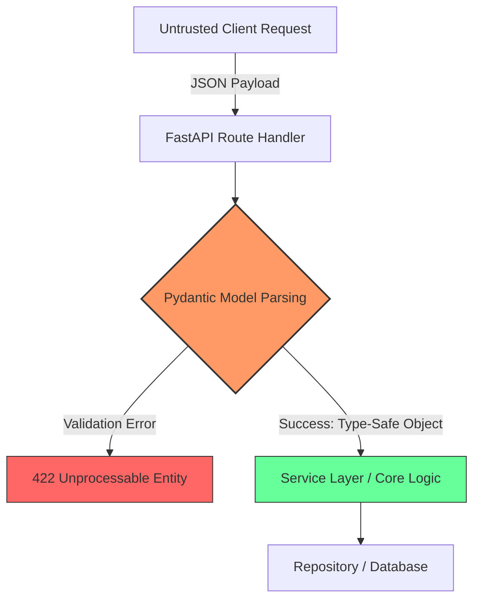
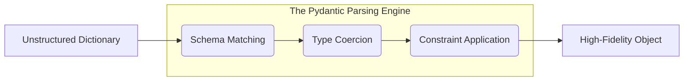
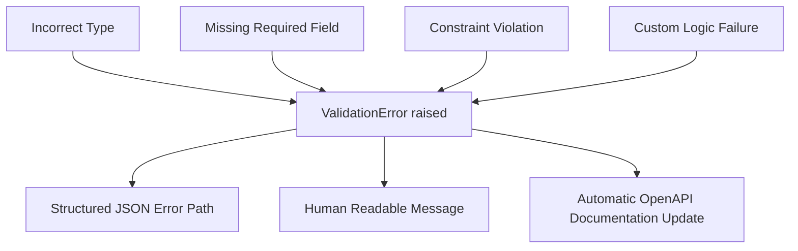

# Formal Specification and Type-Safe Data Orchestration in Python: Leveraging Pydantic within the FastAPI Ecosystem

**Author**: Technical Engineering Team  
**Keywords**: Type Safety, Pydantic, FastAPI, Data Validation, Static Analysis, PEP 585, Parsing.

---

## Abstract

In the context of modern distributed web architectures, the preservation of data integrity across disparate service boundaries is a critical engineering challenge. This paper examines the role of Pydantic as a generative engine for formal data specification within the FastAPI framework. We explore how declarative class-based models, underpinned by Python’s native type hinting system, facilitate robust data orchestration, reduce runtime entropy, and automate the generation of standards-compliant documentation (OpenAPI/JSON Schema). By transitioning from imperative validation to a "parsing-first" paradigm, developers can bridge the gap between static type-checking and runtime safety.

---

## 1. Introduction: The Data Entropy Dilemma

Web applications are inherently consumers of untrusted, non-deterministic data. Traditional approaches to data handling in Python often relied on manual verification of dictionaries, leading to fragmented validation logic and "silent failures."

### 1.1 Architectural Data Flow
The following diagram illustrates how Pydantic acts as a high-fidelity filter at the application boundary:



---

## 2. Declarative Contracts and Structural Composition

The strength of Pydantic lies in its ability to model complex, nested hierarchies through structural composition.

### 2.1. Nested Model Hierarchies
Consider a complex configuration object. By nesting models, we create a recursive validation tree:

```python
from typing import List, Optional
from pydantic import BaseModel, Field

class AccessToken(BaseModel):
    token: str
    expires_in: int

class UserSession(BaseModel):
    session_id: str
    auth: AccessToken  # Model Composition
    ip_addresses: List[str] = Field(min_length=1)

class SecurityAudit(BaseModel):
    user_id: str
    sessions: List[UserSession]
```

---

## 3. The Paradigm Shift: Parse, Don't Validate

A core tenet of research-grade data engineering is the philosophy of **"Parse, don't validate."** 

### 3.1 Logical Chain of Parsing
The transformation from unstructured "data" to structured "information" follows a strict causal chain:



### 3.2 "Show, Don't Tell": The Parsing Boundary
```python
# Raw non-deterministic data
raw_json = {
    "user_id": "usr_99",
    "sessions": [{
        "session_id": "sess_01",
        "auth": {"token": "abc", "expires_in": 3600},
        "ip_addresses": ["127.0.0.1"]
    }]
}

# The result is a high-fidelity object with IDE support
audit = SecurityAudit(**raw_json)
print(audit.sessions[0].auth.token)  # Autocomplete works here
```

---

## 4. Beyond Types: Algorithmic Constraint Enforcement

Pydantic allows for the injection of custom algorithmic logic into the validation lifecycle via the `@field_validator` decorator.

### 4.1. Complex Cross-Field Logic
```python
from pydantic import field_validator, model_validator

class PaymentRequest(BaseModel):
    amount: float
    discount: float
    currency: str

    @field_validator("amount")
    @classmethod
    def amount_must_be_positive(cls, v: float) -> float:
        if v <= 0:
            raise ValueError("Amount must be greater than zero")
        return v

    @model_validator(mode="after")
    def validate_discount_ratio(self) -> "PaymentRequest":
        if self.discount >= self.amount:
            raise ValueError("Discount cannot exceed the total amount")
        return self
```

---

## 5. Error Transparency: Analyzing Validation Failures

A critical requirement for "research-grade" systems is clear error reporting. 

### 5.1 Cause-Effect: Failure Propagation
When an input violates the formal specification, the cause is localized and reported as a structured effect:



### 5.2 Error Localization Example
```json
[
  {
    "type": "value_error",
    "loc": ["__root__"],
    "msg": "Value error, Discount cannot exceed the total amount",
    "input": {"amount": 10, "discount": 20, "currency": "USD"}
  }
]
```

---

## 6. Serialization and Data Interchange

Transitioning between internal objects and interchange formats (JSON) is handled via `model_dump`:

```python
# Deserialization (JSON -> Object)
data = PaymentRequest.model_validate_json('{"amount": 100, "discount": 5, "currency": "USD"}')

# Serialization (Object -> Dict)
export_dict = data.model_dump(exclude={"discount"}) # Granular export control
```

---

## 7. Conclusion

By shifting from imperative validation to declarative, high-fidelity parsing, engineering teams can build resilient Python architectures. The combination of structural composition, custom algorithmic validators, and structured error reporting makes Pydantic the definitive standard for data orchestration in the FastAPI ecosystem.
