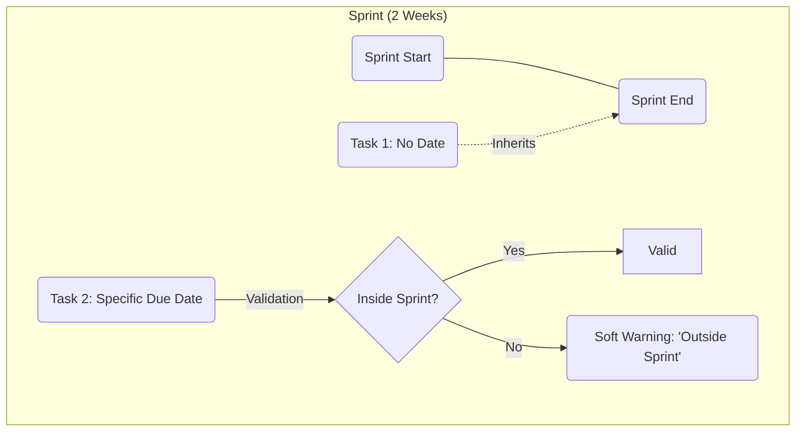
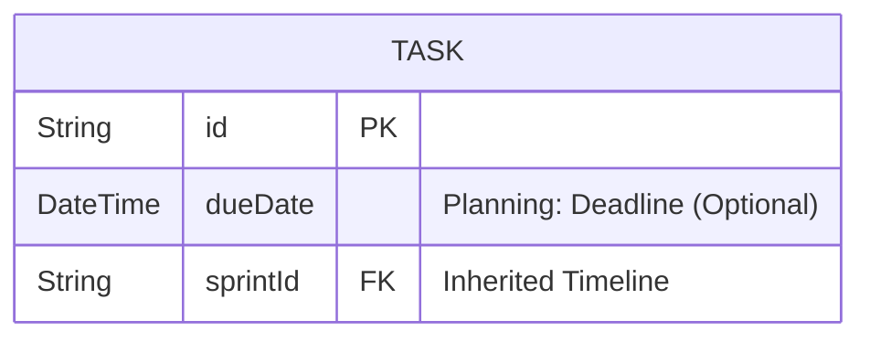

# Strategic Analysis & Implementation: Due Date Only

## 1. Executive Summary & Business Logic

### The "Due Date" Focus
We are simplifying the planning model to focus primarily on **Deadlines**. "Start Date" is removed to reduce cognitive load; users planning individual tasks primarily care about *when it needs to be done*.

| Context | Default Deadline | Specific Deadline (Task Field) |
| :--- | :--- | :--- |
| **Sprint Task** | **Sprint End Date** | Optional *override* (e.g., "Day 3 of Sprint") |
| **Backlog Task** | None | **Encouraged** (No defaults, no strict forcing) |

> **Process Decision**: We "Follow Sprint".
> *   If a task is added to a Sprint -> It automatically inherits the "Plan".
> *   Specific `Due` dates on the task are treated as **Refinements** (sub-blocks inside the sprint).



## 2. Strategic Fit: Future & Market Analysis

### Market Positioning (The "Notion-like" Niche)
Our target audience values **Fluidity > Rigidity**.
*   **The Problem with "Start Dates"**: Traditional PM tools (Jira/MS Project) enforce a "manufacturing" mindset where every unit of work has a precise assembly start time. Knowledge work is messier.
*   **Niche Alignment**: By offering a single, optional `dueDate`, we align with "Personal Productivity" habits while retaining "Enterprise Power" (Sprints).
    *   *Result*: Lower friction entry. A user can just say "Do this by Friday" without thinking about when they will *start*.

### Future-Proofing & Scalability
How does this decision hold up 2 years from now?
1.  **Gantt Chart Compatibility**:
    *   *Now*: A Gantt chart can infer `Start Date` = `Due Date - EstimatedDuration` (or default 1 day). This allows us to render charts *without* forcing the user to input two dates.
2.  **AI Scheduling**:
    *   *Future*: AI agents work better with *Constraints* (Due Date) than specific instructions. It is easier for an AI to optimize a schedule if it knows "Must be done by X" rather than "Must start at Y".
3.  **Performance**:
    *   Single-field indexing makes `ORDER BY due_date ASC` queries extremely fast, even at millions of rows, compared to complex range overlaps.

## 3. Technical Implementation

### Database Schema (Prisma)
We will add a single `DateTime` field for the deadline.
field


#### [MODIFY] [prisma/schema.prisma](file:///home/resgef/works/notion-clone/prisma/schema.prisma)
```prisma
model Task {
  // ... existing fields
  
  // -- Planning Field --
  // Renamed to match business logic
  dueDate   DateTime?  @map("due_date")
}
```

### UI Implementation Strategy

#### A. Task Pane (Input)
*   **Field**: Single "Due Date" picker.
*   **Behavior**:
    *   **No Default**: Field is empty by default. User must explicitly pick a date.
    *   **No Strict Mode**: We will not block creation or annoy the user if they leave it empty. It's a tool, not a cop.

#### B. Visual Feedback
*   **List/Board View**: Show date label `Oct 15`.
*   **Styling**:
    *   Future: Gray.
    *   Today/Tomorrow: Orange.
    *   Past (Overdue): Red text.

## 4. Execution Checklist

### Phase 1: Database & API
- [ ] **Schema**: Add `dueDate` to [schema.prisma](file:///home/resgef/works/notion-clone/prisma/schema.prisma).
- [ ] **Migrate**: Run `prisma migrate dev --name add_due_date`.

### Phase 2: User Interface
- [ ] **Task Pane**: `DueDateControl`.
    - [ ] Single DatePicker.
    - [ ] Warn if Due Date > Sprint End (Soft warning).
