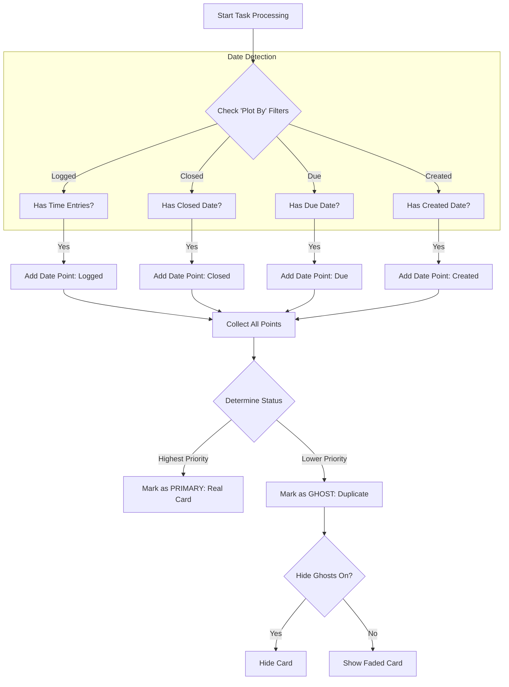

# Goal: Plot Tasks by Due Date in TimeScale

The user wants to visualize tasks on the timeline based on their **Due Date**. This adds a new dimension to the "Plot Tasks By" filter, allowing users to see when tasks are due relative to when they were created or closed.

## 1. Plotting Engine Logic

The TimeScale engine iterates through every task and determines where to place it based on the active filters. We are inserting **Due Date** into the existing priority chain using the following logic:



## 2. Priority Hierarchy

The system needs to decide which card is the "Real" one and which are "Ghosts" when multiple filters are active.

**New Priority Order:**
1.  **📊 Logged Bands** (Execution Reality) - *Highest*
2.  **✅ Closed Date** (Completion Reality)
3.  **📅 Due Date** (Planning Intent) - *New Position*
4.  **📅 Creation Date** (Origin) - *Lowest*

## 3. Filter Interaction Matrix

How the "Hide Ghosts" toggle interacts with your selection:

| Active Filters | Task Data | Resulting View | "Hide Ghosts" Effect |
| :--- | :--- | :--- | :--- |
| **Due Only** | Has Due Date | **1 Card** (Due) | None |
| **Due** + **Created** | Has Both | **2 Cards**<br>Primary: Due<br>Ghost: Created | **Created** card disappears.<br>View focuses on Due Date. |
| **Logged** + **Due** | Has Both | **2 Cards**<br>Primary: Logged<br>Ghost: Due | **Due** card disappears.<br>View focuses on Work Done. |

## 4. Proposed Changes

### UI Changes ([TimeScaleControlPanel.tsx](file:///home/resgef/works/notion-clone/src/components/TimeScaleControlPanel.tsx))
[src/components/TimeScaleControlPanel.tsx](file:///home/resgef/works/notion-clone/src/components/TimeScaleControlPanel.tsx)
-   Add `"due"` toggle to "Plot Tasks By" group.
-   Insert before "Creation Date".

### Logic Changes ([TimeScale.tsx](file:///home/resgef/works/notion-clone/src/components/TimeScale.tsx))
[src/components/TimeScale.tsx](file:///home/resgef/works/notion-clone/src/components/TimeScale.tsx)
-   **Update Types**: Add `"due"` to [TimeMode](file:///home/resgef/works/notion-clone/src/components/TimeScale.tsx#10-11).
-   **Update Priority**: `["logged", "closed", "due", "created"]`
-   **Update Extraction**:
    ```typescript
    if (filters.timeModes.has("due") && task.dueDate) {
        results.push({ time: new Date(task.dueDate), mode: "due" });
    }
    ```

## Verification Plan
1.  **Manual Test**:
    -   Open TimeScale.
    -   Enable "Due Date" filter.
    -   Verify tasks with due dates appear at the correct time.
    -   Enable "Creation Date" filter alongside.
    -   Verify "Hide duplicate ghosts" toggles the secondary card.
